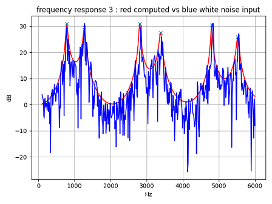
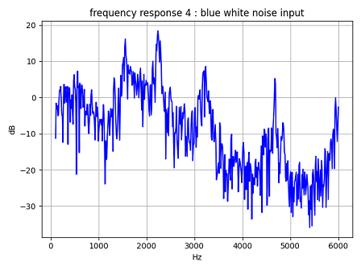
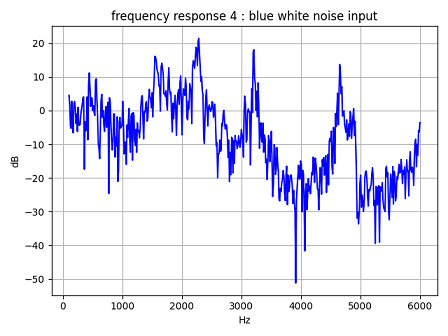

# Vocal Tube T   

This is an experiment of 3-way junction model, T Three Tube Mode.  


## contents    

T_three_tube.py and oneloop_four_tube.py is a definition of the tube model.  

Example: T Three Tube Mode  
comparison computed frequency response to white noise input frequency response using FFT analysis.  
```
python tube_check_T.py
```

   
A3=0 (simple two tube)  
   


Example: one-loop Four Tube Model  
draw white noise input frequency response using FFT analysis.  
```
python tube_check_1loop.py
```
attenuation constant per one step in tube2 and tube3 is 0.998.  
   
attenuation constant per one step in tube2 and tube33 is 1.0.  
   

## License    
MIT  
